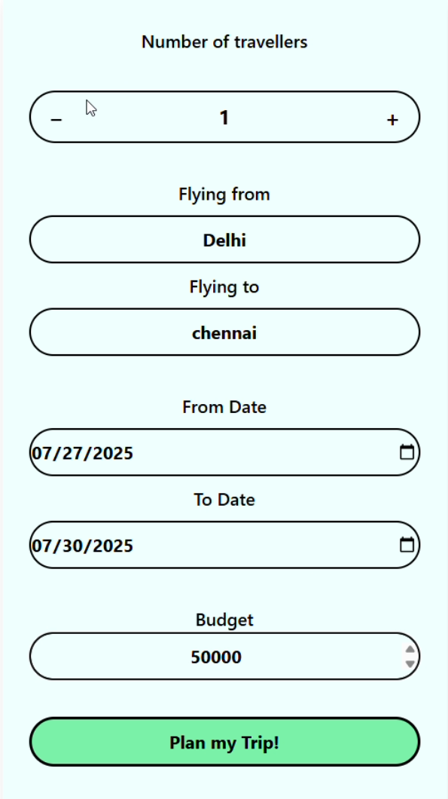
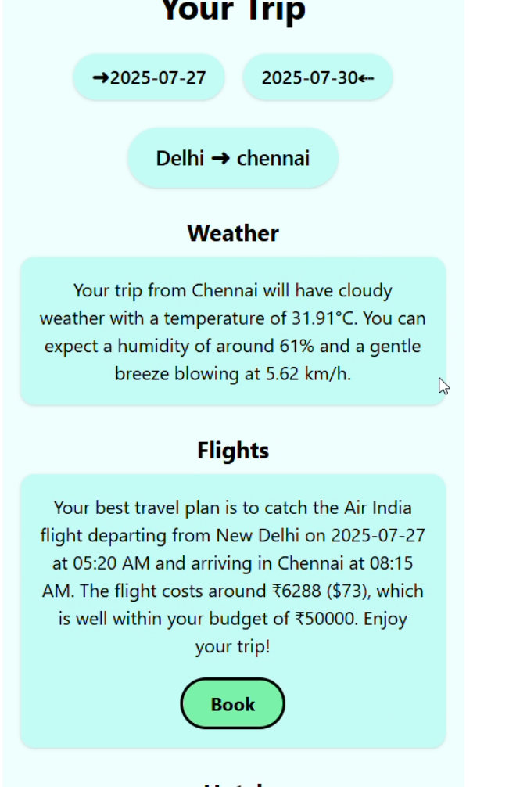
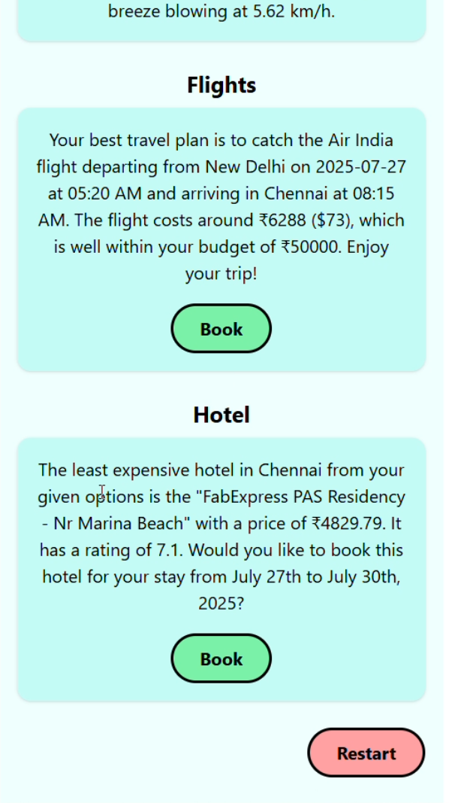

# 🧠✈️ AI Travel Agent

AI Travel Agent is a smart trip planning React application powered by AI APIs. It takes user inputs such as travel dates, budget, source/destination cities, and number of travelers, and returns weather forecasts, flight options, and hotel recommendations — all presented in a clean, mobile-friendly interface.

---

## 🚀 Features

- ✅ AI-powered flight & hotel recommendations
- ✅ Real-time weather forecasting
- ✅ Simple, intuitive, and mobile-optimized UI
- ✅ One-click booking simulation with confirmation dialogs
- ✅ Seamless user experience with conditional rendering
- ✅ Custom API integration using `fetchData`

---

## 📂 Folder Structure

```
AI-Travel-Agent/
├── public/
├── src/
│   ├── App.jsx
│   ├── fetchData.jsx
│   ├── Home.jsx
│   ├── index.css
│   ├── main.jsx
│   ├── TripPlanner.jsx
│   ├── TripSummary.jsx
│   ├── assets/
│   │   └── aitravelAgent.png
│   └── components/
│       └── Dialog.jsx
└── README.md
```

---

## 🧠 How It Works

### 1. Home Page
Users land on a welcoming screen with a **"Let's Begin"** button.

### 2. Trip Planner
Users input:
- Number of travelers
- From and To cities
- Travel dates
- Budget

On submission, it triggers `fetchData(userInputs)`.

### 3. API Calls (`fetchData.jsx`)
Parallel API requests are sent to:
- `/api/ask`: for flight recommendations
- `/api/details`: for weather & hotel suggestions

Results are parsed and returned to the app.

### 4. Trip Summary
Displays:
- Trip dates and cities
- Weather forecast
- Flight options with "Book" button
- Hotel options with "Book" button
- Restart option to plan a new trip

---

## 📸 Screenshots

### 🏠 Home Screen


### ✈️ Trip Planner


### 📋 Trip Summary



---

## 🛠️ Tech Stack

| Technology      | Description                                  |
|-----------------|----------------------------------------------|
| **React.js**    | Component-based frontend                     |
| **Tailwind CSS**| Custom CSS classes used manually             |
| **fetch API**   | Fetches data from external APIs              |
| **DigitalOcean**| Hosted AI backend for data & recommendation  |

---

## 🔌 API Integration

### Endpoint 1: `/api/ask`
Returns flight recommendations.

### Endpoint 2: `/api/details`
Returns weather and hotel details.

Both are triggered together via:
```js
const [res1, res2] = await Promise.all([
  fetch("/api/ask", {...}),
  fetch("/api/details", {...})
]);
```

---

## 🧪 Local Development

### 🧰 Prerequisites
- Node.js v18+
- npm or yarn

### 📦 Install Dependencies
```bash
npm install
```

### ▶️ Run the App
```bash
npm run dev
```

This runs the app on [http://localhost:5173](http://localhost:5173) (Vite dev server).

---

## 📤 Deployment

You can deploy this app using:
- **Vercel**
- **Netlify**
- **GitHub Pages (via Vite)**
- **Any static hosting provider**

Backend is already deployed on **DigitalOcean**.

---

## 📌 Available Scripts

| Script         | Description                 |
|----------------|-----------------------------|
| `npm run dev`  | Runs development server      |
| `npm run build`| Builds the project           |
| `npm run preview` | Previews the production build |

---


## 👨‍💻 Author

**Anuj Kumar Maurya**  
Frontend Developer & AI Enthusiast  
 🔗 [GitHub](https://github.com/codeXanu)  | 🔗 [ X ](https://x.com/codeXanuj) 

---

## 📝 License

This project is open source and free to use under the [MIT License](LICENSE).

---

## 💬 Feedback

Feel free to submit issues or feature requests. Contributions are welcome!